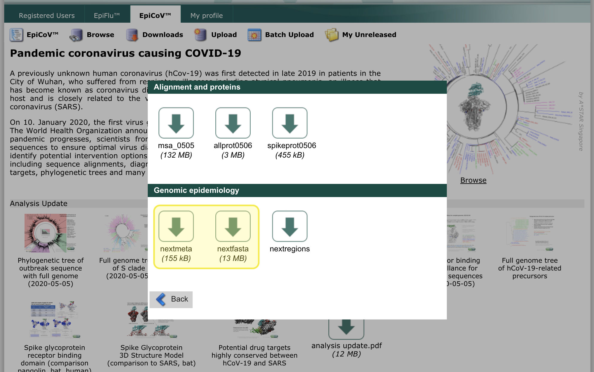
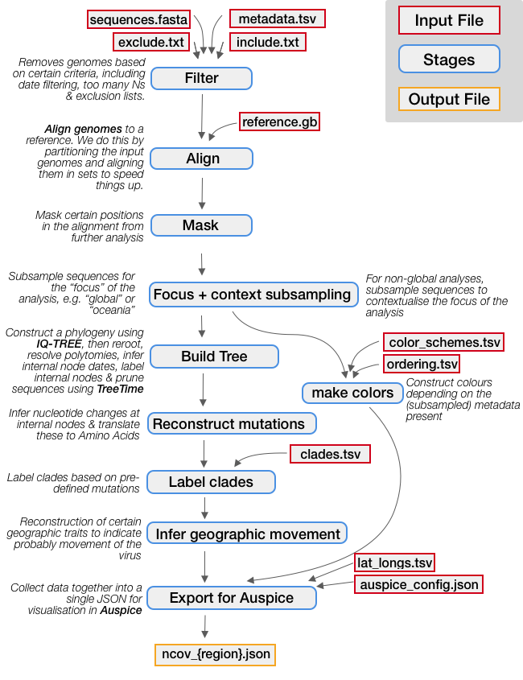

### Running a SARS-CoV-2 analysis

The pipeline described in this repo is designed primarily to run the phylogeographic analyses of SARS-CoV-2 data which are displayed on nexstrain.org, for instance [the global analysis](https://nextstrain.org/ncov/global), the [European subsampled build](https://nextstrain.org/ncov/europe), the [North American build](https://nextstrain.org/ncov/north-america) etc.

It is also possible to run your own data through the same analysis pipeline.
Because Nextstrain is open-source, you may modify the analysis to suit your particular needs.

#### A few points before we dive in:

- If you haven't run an analysis using Nextstrain before, I **highly recommend** running the [zika tutorial](https://nextstrain.org/docs/tutorials/zika) first, which introduces these concepts in a gentler fashion.
- If you would like to use Nextstrain Groups, such as [this one](https://nextstrain.org/groups/blab/), to share your results through nextstrain.org then please [get in touch](mailto:hello@nextstrain.org)! You will have control & ownership of the datasets and narratives, but they can be shared freely through nextstrain.org. These are also available in a private fashion for sensitive data.


#### This page consists of four parts:

- Curating your own input data
- Running the default build using Snakemake
- Understanding the parts of the analysis
- Debugging common issues


## Curating your own input data

Curating sequences and input data is a crucial part of running your own analysis.
Here we assume you have two data sources which you wish to analyse together:

1. Your own genomes & metadata (perhaps collected by your lab)
2. The global data, or a subset of this, so that you can see your data in context.

> As the global dataset grows, subsampling becomes important.
We will write guidance for subsampling in a future page, but you can investigate the `Snakefile_Regions` to see how we perform subsampling for our regional builds.

#### Obtaining global data through GISAID

For the nextstrain.org analyses, we use data obtained through [GISAID](https://gisaid.org).
Once you have logged into GISAID's EpiCoV site, click "Downloads" to bring up a modal window.
In this window click on "nextmeta" to download the file `nextstrain_metadata.tsv.bz2`.
This should be decompressed and saved as `data/global_metadata.tsv`.
Then, in this window click on "nextfasta" to download the file `nextstrain_sequences.fasta.bz2`.
This should be decompressed and saved as `data/global_sequences.fasta`.



> Please note that `data/metadata.tsv` is no longer included as part of this repo and should be downloaded directly from GISAID.

#### Your own data

This should consist of
- a FASTA file with the (unaligned) genomes. Sequence names must not contain characters such as spaces, or `()[]{}|#><` (except for the `>` character which starts each entry in a FASTA file).
- the metadata corresponding to each of your genomes.  Please see [metadata documentation](./metadata.md) for details on the format of this metadata.


#### Combining the data

Let's assume you now have four files:
1. `data/global_sequences.fasta` - genomes of worldwide data to provide phylogenetic context
2. `data/global_metadata.tsv` - Metadata of these (global) genomes. This could be a copy of the `data/metadata.tsv` that's included in this repo.
3. `data/our_sequences.fasta` - Your own sequences, in FASTA format.
4. `data/our_metadata.tsv` - metadata of your genomes. We'll assume this follows the [same format](./metadata.md) as (2).

We can combine the two sets of genomes simply via
```bash
cat data/our_sequences.fasta data/global_sequences.fasta > data/sequences.fasta
```
And, as long as the metadata formats are the same, then we can add our metadata via:
```bash
cp ./data/global_metadata.tsv ./data/metadata.tsv
tail +2 ./data/our_metadata.tsv >> ./data/metadata.tsv
```
(Please double check that the columns in this new, merged metadata TSV match up. It's not a problem if there are more entries (rows) in the metadata than the total number of genomes.)

## Configure your Snakemake profile

You can define all the settings you commonly use to execute Snakemake with a [Snakemake profile](https://snakemake.readthedocs.io/en/stable/executing/cli.html#profiles).
Profiles save keystrokes and document how you prefer to run your pipelines.
For example, if you prefer to run your pipeline with at most 2 CPUs at a time and print both commands and the reasons for the commands being run, you would normally run the following command.

```bash
snakemake --cores 2 --printshellcmds --reason
```

However, you can get the same result by defining a profile config file (e.g., `profiles/default/config.yaml`) and running the following command.

```bash
snakemake --profile profiles/default
```

For the purposes of this tutorial, we provide this default profile that you can modify to meet your own needs.

## Configuring your build

The default build is parameterized by a [Snakemake configuration file](https://snakemake.readthedocs.io/en/stable/snakefiles/configuration.html) named `config/config.yaml`.
In most cases, you should not need to modify these parameters.
Instead, you can define your own analysis and tweak parameters by creating your own profile, more on this below.

To do so, copy `profiles/default` to `profiles/<my-new-profile-name>` and open the `builds.yaml`
file in this directory.
This file specifies the analysis you want to run in a data structure called `builds`.
Each entry has `build_name` which in the example is `global`.
For each build, you can specify

 - `subsampling_scheme`: specifies how sequences are selected. Default schemes exist for `region`, `country`, and `division`. Custom schemes can be defined (see below).
 - `geographic_scale` and `geographic_name`: together, these two define the keys for subsampling. `geographic_name` defaults to `build_name` if not specified.

For our Switzerland specific builds, this looks like this:
```yaml
builds:
  switzerland:
    subsampling_scheme: country
    geographic_scale: country
  basel-stadt:
    subsampling_scheme: canton
    geographic_scale: division
  ticino:
    subsampling_scheme: canton
    geographic_scale: division
  lac-leman:
    subsampling_scheme: lac-leman
    geographic_scale: division
```
These subsampling schemes for the cantons and the composite region `lac-leman` are
not one our default scheme but custom ones.


### Custom subsampling schemes
We implement hierarchical subsampling by producing multiple samples at different geographic scales
and merge these samples into one file for further analysis.
A build can specify any number of such samples which can be flexibly restricted to particular
meta data fields and subsampled from groups with particular properties.
For canton's this looks like this:
```yaml
subsampling:
  # Default subsampling logic for divisions
  canton:
    # Focal samples for division (only samples from a specifed division with 300 seqs per month)
    division:
      group_by: "year month"
      seq_per_group: 300
      exclude: "--exclude-where 'region!={{region}}' 'country!={{country}}' 'division!={{division}}'"
    # Contextual samples from division's country
    country:
      group_by: "division year month"
      seq_per_group: 20
      exclude: "--exclude-where 'region!={{region}}' 'country!={{country}}' 'division={{division}}'"
      priorities:
        type: "proximity"
        focus: "division"
    # Contextual samples from division's region
    region:
      group_by: "country year month"
      seq_per_group: 10
      exclude: "--exclude-where 'region!={{region}}' 'country={{country}}'"
      priorities:
        type: "proximity"
        focus: "division"
    # Contextual samples from the rest of the world, excluding the current
    # division to avoid resampling.
    global:
      group_by: "country year month"
      seq_per_group: 5
      exclude: "--exclude-where 'region={{region}}'"
      priorities:
        type: "proximity"
        focus: "division"
```
All entries above canton level specify priorities. Currently, we have only implemented
one type of priority called `proximity`.
It attempts to selected sequences as close as possible to the focal samples
specified as `focus: division`.
The argument of the latter has to match the name of one of the other subsamples.

If you need parameters in a way that isn't represented by the configuration file, [create a new issue in the ncov repository](https://github.com/nextstrain/ncov/issues/new) to let us know.

### Additional build-specific configuration
We currently allow for build-specific trait reconstruction and decoration with travel exposure traits.
The default configuration for these steps sits in `config/config.yaml` and can be overridden
by build specific settings by adding blocks like the following to the `builds.yaml` of your profile:
```yaml
exposure:
  north-america:
    trait: "division"
    exposure: "division_exposure"

traits:
  north-america:
    sampling_bias_correction: 2.5
    columns: ["country_exposure", "division_exposure"]
```
This would define settings for the rules `traits` and `exposure` that deviate from the default settings.
Currently such build specific parameters are supported for `traits`, `exposure`, and `subsampling`.
We are working on generalizing our workflow further.

## Running the default build

If the data is in the correct formats (`./data/sequences.fasta` & `./data/metadata.tsv`) then we can generate the analysis by simply running

```bash
snakemake --profile profiles/default
```

Which will produce a `./auspice/ncov_global.json` file which you can visualise in Auspice via

```bash
auspice view --datasetDir auspice
```

## Understanding the parts of the analysis

The Snakemake analysis here consists of a number of rules, which are displayed below.
Not all of the rules included are essential, or may even be desirable for your analysis.
We maintain this snakefile primarily for our own analyses, and thus your build may be able to be made a lot simpler!
The aim of this tutorial is to walk you through the rules in the basic analysis run by Nextstrain and to give you the ability to change it to suit your needs.

> Note: this repo contains a few different Snakefiles, as we use them to automate a number of analyses, some of which are beyond the scope of this tutorial.
This tutorial follows the main `Snakefile`.


Each snakemake rule produces output which may be used by other rules; these "dependencies" are indicated by grey arrows.
Additionally, there are input files which must be provided (e.g. the sequence data generated above, or other files which are part of this repo); these are indicated with red outlines.
Please inspect the `Snakefile` to see what each rule is doing in more detail and if there are any questions please [make an issue](https://github.com/nextstrain/ncov/issues/new) so that we can improve this page!



## Debugging common issues

> If you have a question which is not addressed here, please consider [making an issue](https://github.com/nextstrain/ncov/issues/new) so that we can improve these documentation 👍

#### My country / division does not show up on the map

This is most often a result of the country / division not being present in [the file defining the latitude & longitude of each deme](../config/lat_longs.tsv).
Adding it to that file (and rerunning the Snakemake rules downstream of this) should fix this.
You can rerun the appropriate parts of the build via:

```bash
snakemake --profile profiles/default -f results/region/global/ncov_with_accessions.json
snakemake --profile profiles/default -f auspice/ncov_global.json
```

#### My trait (e.g. division) is grey instead of colored

We generate the colors from the `colors` rule in the Snakefile, which uses the [ordering TSV](../ordering.tsv) to generate these.
Once you've modified this file, you can regenerate the appropriate parts of the analysis via:

```bash
snakemake --profile profiles/default -f config/colors_global.tsv
snakemake --profile profiles/default -f auspice/ncov_global.json
```

#### My genomes aren't included in the analysis

There are a few steps where sequences can be removed:

- During the `filter` step:
    - Samples which are included in [the exclude file](../config/exclude.tsv) are removed
    - Samples which fail the current filtering criteria, as defined in the Snakefile, are removed. You can modify the snakefile as desired, but currently these are:
        - Minimum sequence length of 25kb
        - No ambiguity in (sample collection) date
        - A random subsampling of 500 sequences per division per month
  - During the `refine` step, where samples that deviate more than 4 interquartile ranges from the root-to-tip vs time are removed

#### Error: Where there's SAMPLING_TRAIT we should always have EXPOSURE_TRAIT

This comes from an incomplete metadata file.
If you define (e.g.) `country` for a sample then you _must_ also define `country_exposure` for that sample.
If there is no (known) travel history, then you can set the same values for each.
